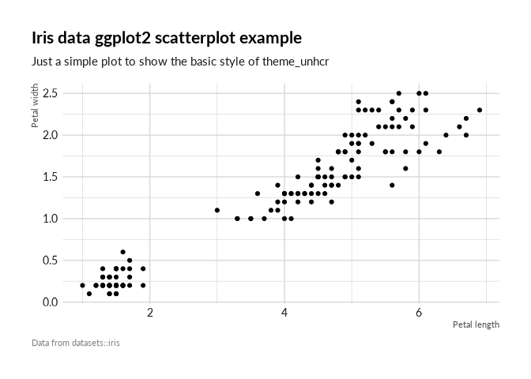

<!-- README.md is generated from README.Rmd. Please edit that file -->

# unhcrthemes

<!-- badges: start -->
<!-- badges: end -->

The goal of unhcrthemes is to provide a collection of template, palettes
and themes for plots, documents, and slides based on UNHCR branding.

## Installation

You can install the released version of unhcrthemes from
[CRAN](https://CRAN.R-project.org) with:

``` r
install.packages("unhcrthemes")
```

And the development version from [GitHub](https://github.com/) with:

``` r
# install.packages("devtools")
devtools::install_github("vidonne/unhcrthemes")
```

## Usage

``` r
library(unhcrthemes)
library(ggplot2)

# install.packages('showtext', dependencies = TRUE)
library(showtext)

# Check the current search path for fonts
allfontpath <- font_paths()    

# List available font files in the search path
allfont <- font_files()

# syntax: font_add(family = "<family_name>", regular = "/path/to/font/file")
font_add("Lato", regular = "Lato-Regular.ttf",  bold = "Lato-Bold.ttf", italic = "Lato-Italic.ttf")

# automatically use showtexts for new devices
showtext_auto()
```

### Base ggplot2 theme

``` r
ggplot(datasets::iris, aes(x = Petal.Length, y = Petal.Width)) +
  geom_point() +
  labs(x="Petal length", y="Petal width",
      title = "Iris data ggplot2 scatterplot example",
      subtitle= "Just a simple plot to show the basic style of theme_unhcr",
      caption = "Data from datasets::iris") +
  theme_unhcr()
```

<!-- -->
